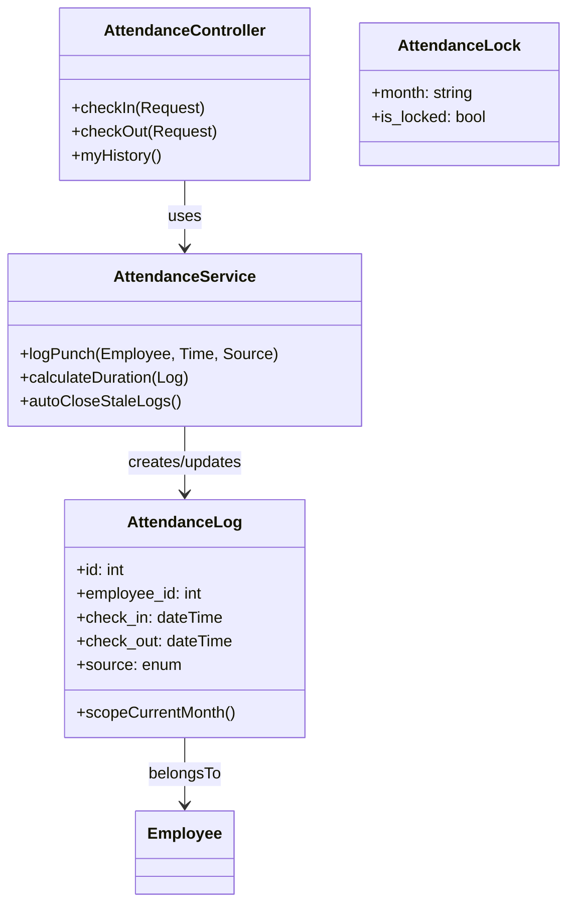

# 📘 EMS Deep Dive: Technical Specifications & SaaS Roadmap

## 1. UX Wireframe Descriptions

### A. Dashboard View (Employee List)
*   **Layout**: Top Navbar (User Profile), Left Sidebar (Navigation), Main Content Area.
*   **Header**: "Employee List" title + Primary Action Button ("+ New Employee").
*   **Data Grid**:
    *   **Columns**: Employee Code (EMP-XXX), Full Name with Avatar, Department Badge, Job Title, Status (Active/Probation).
    *   **Actions**: "Edit" (Pencil Icon) triggers Modal; "View Profile" (Eye Icon).
*   **Pagination**: Bottom right standard pagination (Prev 1 2 3 Next).
*   **Loading State**: Skeleton rows or spinner overlay while fetching `GET /api/employees`.

### B. Attendance View (Self-Service)
*   **Focus**: Large, accessible clock-in interface for employees.
*   **Components**:
    *   **Digital Clock**: Huge, central real-time HH:MM:SS display.
    *   **Action Buttons**: Two large, distinct buttons.
        *   GREEN "Check In" (Disabled if already checked in).
        *   RED "Check Out" (Disabled if not checked in).
    *   **Status Indicator**: Text "Current Status: Checked In since 08:00 AM".
    *   **Recent Logs**: A simplified list below showing last 5 punches (Date | In | Out | Duration).

### C. Payroll View (Admin Only)
*   **Control Panel**: Top toolbar with:
    *   **Month Picker**: `YYYY-MM` selector.
    *   **Lock Toggle**: Button/Switcher to "Lock" attendance for the selected month to prevent changes.
    *   **"Run Payroll"**: Primary CTA button.
*   **Summary Cards**: top stats: "Total Payroll Cost", "Net Payable", "Tax Collected".
*   **Payslip Table**:
    *   **Rows**: Employee Name, Basic Salary, Deductions (Absence), Tax, Net Pay, status (Paid/Pending).
    *   **Actions**: "Download PDF" (Icon), "Email Slip" (Envelope).

---

## 2. Attendance Rule Pseudocode

```pseudocode
FUNCTION CheckIn(User):
    IF User.isNotEmployee RETURN Error("Unauthorized")
    
    // Prevent double check-in
    ExistingLog = DB.AttendanceLogs.Find(User.ID, Today, CheckOut=NULL)
    IF ExistingLog EXISTS:
        RETURN Error("Already Checked In")

    Log = NEW AttendanceLog
    Log.employee_id = User.employee_id
    Log.check_in = NOW()
    Log.source = "WEB_PORTAL" // or "BIOMETRIC"
    Log.save()
    
    RETURN Success("Welcome back")

FUNCTION CheckOut(User):
    Log = DB.AttendanceLogs.FindMostRecentActive(User.ID)
    
    IF Log IS NULL:
        RETURN Error("No Active Check-in Found")
        
    // Calculate Duration
    Duration = NOW() - Log.check_in
    IF Duration > 24 HOURS:
        // Edge case: Forgot to checkout yesterday
        Log.check_out = Log.check_in + 9 HOURS // Auto-close rule
        Log.flag = "AUTO_CLOSED"
        Log.save()
        RETURN Warning("Previous session auto-closed. Please check-in again.")
    
    Log.check_out = NOW()
    Log.save()
    RETURN Success("Goodbye")
```

---

## 3. Payroll Engine Validation Logic

### Logic Flow for `generatePayroll(Month)`

1.  **Pre-Flight Validation**:
    *   `IF PayrollRun(Month) EXISTS`: RETURN Error("Payroll already generated. Delete old run first.")
    *   `IF AttendanceLock(Month) IS FALSE`: RETURN Warning("Attendance not locked. Computations may drift.")
    
2.  **Calculation Loop (Per Employee)**:
    *   **Determining Days Worked**:
        *   `WorkingDays` = Count UNIQUE dates in `AttendanceLogs` where `check_in` is between `MonthStart` and `MonthEnd`.
    *   **Pro-Rata Deduction**:
        *   `StandardDays` = 26
        *   `DailyRate` = `BasicSalary` / 26
        *   IF `WorkingDays` < 26:
            *   `Deduction` = (26 - `WorkingDays`) * `DailyRate`
        *   ELSE: `Deduction` = 0
    
3.  **Tax Calculation (Cambodia Model)**:
    *   `GrossPay` = `BasicSalary` - `Deduction`
    *   **NSSF Contribution**: `NSSF` = `GrossPay` * 2% (Capped at fixed limit if applicable).
    *   **Tax Base**: `TaxableIncome` = `GrossPay` - `NSSF` - `Spouse/Child Allowances`.
    *   **Tax Bracket** (Progressive):
        *   0 - 1,500,000 KHR: 0%
        *   1,500,001 - 2,000,000 KHR: 5%
        *   ... up to 20%
    *   *Note*: Must handle USD -> KHR Exchange Rate (e.g., 4100) for bracket lookup, then convert back.

4.  **Final Commit**:
    *   Wrap in `DB::transaction`.
    *   Create `PayrollRun` header.
    *   Batch insert `PayrollItems`.

---

## 4. SaaS Multi-Tenant Conversion Plan

To convert this single-tenant app to a SaaS model supporting multiple companies:

| Component | Change Strategy |
| :--- | :--- |
| **Database** | **Shared Database, Schema-based Tenancy** (easiest for MVP). Add `company_id` column to *every* relevant table (`users`, `employees`, `attendance_logs`, `departments`, etc.). |
| **Auth** | Users login via a central portal but `user` record is scoped to `company_id`. |
| **Routing** | **Subdomain Routing**: `tenant.ems-app.com`. Middleware resolves `tenant` slug to `Company` entity. |
| **Scope** | Create a Global Scope implementation (Laravel `SalesScope` or `TenantScope`) that automatically adds `where('company_id', $currentCompany->id)` to all Eloquent queries. |

### Implementation Steps
1.  **Migration**: Add `company_id` foreign key to all tables.
2.  **Middleware**: Create `IdentifyTenant` middleware.
    ```php
    $host = $request->getHost();
    $subdomain = explode('.', $host)[0];
    $company = Company::where('slug', $subdomain)->firstOrFail();
    session(['company_id' => $company->id]);
    ```
3.  **Models**: Use a Trait `BelongsToTenant` on all models.
    ```php
    static::addGlobalScope('tenant', function (Builder $builder) {
        $builder->where('company_id', session('company_id'));
    });
    ```

---

## 5. Laravel Class Structure (Attendance Domain)



---

## 6. Multi-Tenant Migration Strategy (Single to SaaS)

**Phase 1: Zero-Downtime Schema Upgrade**
1.  Add `company_id` to tables (nullable initially).
2.  Create a "Default Company" (ID: 1) for the existing single-tenant data.
3.  Run SQL script to update all existing records:
    ```sql
    UPDATE users SET company_id = 1;
    UPDATE employees SET company_id = 1;
    -- repeat for all tables
    ```
4.  Alter columns to be `NOT NULL`.

**Phase 2: Codebase Isolation**
1.  Deploy `TenantScope` trait to models but disable it by default.
2.  Test enabling it for Company 1. Ensure `User::all()` only returns Company 1 users.

**Phase 3: Onboarding & DNS**
1.  Create `GET /register-company` page (SaaS Sign-up).
2.  Configure Wildcard DNS (`*.ems-app.com`) to point to the Load Balancer.
3.  Production Cutover: Existing users access via `default.ems-app.com` (or redirect root to it).
